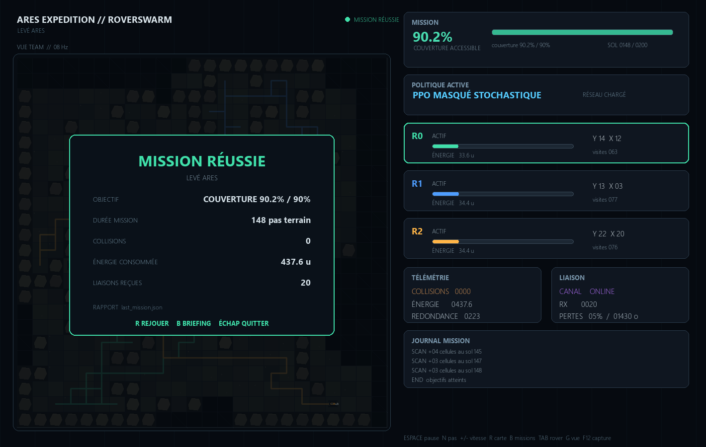

# RoverSwarm

RoverSwarm est un démonstrateur 2D d’exploration coopérative par robots autonomes. Il vise une première version crédible pour un portfolio d’ingénierie robotique, embarquée et spatiale : moteur synchrone déterministe, perceptions partielles, énergie, collisions, PPO réellement optimisé, références programmées, communication bornée, mesures et interface de mission.

Le projet est volontairement une simulation sur grille. Il ne prétend pas modéliser la dynamique d’un rover, une radio physique, un SLAM ou un système utilisable sur matériel réel.



**Version 1.0** — jeu de mission complet, modèle V5 sélectionné sur validation, test final réservé et résultats reproductibles.

## État de la version

- moteur commun mono-robot et trois robots ;
- interfaces Gymnasium et PettingZoo ParallelEnv ;
- PPO mono-robot et PPO partagé pour trois agents ;
- politiques ALÉATOIRE et FRONTIÈRES explicitement programmées ;
- visualisation Pygame-ce et rendu RGB sans fenêtre ;
- canal programmé avec portée, fréquence, capacité, délai et pertes ;
- export CSV, JSON et graphique à partir des résultats mesurés ;
- tests unitaires, vérificateurs officiels et smoke test PPO.

Le PPO partagé n’est pas du MAPPO : tous les robots utilisent le même réseau acteur-critique, chaque action dépend uniquement de l’observation locale correspondante et le critique n’est pas centralisé.

## Installation Windows

Le projet se trouve dans D:\RoverSwarm. L’environnement utilisé pour les exécutions documentées est D:\RoverSwarm\.venv avec Python 3.14.

    Set-Location D:\RoverSwarm
    .\scripts\setup.ps1
    .\.venv\Scripts\Activate.ps1

L’installation reste locale au projet. Aucun CUDA n’est imposé ; les profils fournis utilisent le CPU par défaut.

Sous Linux :

    cd /chemin/vers/RoverSwarm
    bash scripts/setup.sh
    source .venv/bin/activate

## Démonstrations

### Mission Control

L’interface recommandée constitue une boucle de jeu complète : briefing, sélection de mission, déploiement, télémétrie en direct, réussite ou échec, puis débriefing enregistré. Elle affiche une carte d’opérations avec terrain minéral procédural, brouillard de connaissance, trajectoires, rovers orientés, capteur, énergie, communications et journal de mission.

Sous Windows, lancer simplement `JOUER.bat` par double-clic. Depuis un terminal :

    python -m roverswarm.mission_control

Le jeu propose trois missions :

- **Levé Ares** : cartographier 90 % de la zone accessible ;
- **Zone de silence** : retrouver deux relais, les réactiver et couvrir au moins 72 % du secteur ; chaque relais améliore réellement la portée, le délai et le taux de perte du canal ;
- **Réserve critique** : inspecter deux anomalies géologiques, couvrir au moins 60 % du secteur et conserver un rover actif avec une énergie initiale réduite.

Le meilleur modèle V5 est chargé automatiquement depuis `models\roverswarm_v5_seed97.zip`. Il reste possible de choisir explicitement une autre politique ou un autre modèle pour les expériences.

Capture automatisée sans ouvrir de fenêtre :

    python -m roverswarm.mission_control --no-briefing --steps 100 --screenshot ".\artifacts\results\mission_control_v2.png"

Commandes : Espace pause, N un pas, + et - vitesse, R nouvelle carte, B retour aux missions, Tab sélection du rover, G vue équipe/robot/globale, F12 capture et Échap quitter.

À la fin de chaque mission, le bilan est sauvegardé dans `artifacts\results\last_mission.json` avec la couverture, la durée, les collisions, l’énergie, les communications et l’état de chaque rover.

L’ancienne interface légère reste disponible avec roverswarm.visualize.

Référence par frontières :

    python -m roverswarm.visualize --profile smoke --policy frontier

Même démonstration avec communication :

    python -m roverswarm.visualize --profile smoke --policy frontier --communication

PPO : un modèle réel est obligatoire. En son absence, la commande échoue clairement et ne substitue aucune règle.

    python -m roverswarm.visualize --profile smoke --policy ppo --model artifacts\models\ppo_shared_smoke.zip

Mode sans fenêtre :

    python -m roverswarm.visualize --profile smoke --policy frontier --headless --steps 100

Commandes de l’interface : Espace pause/reprise, N un pas, + et - vitesse, R nouvelle carte, Tab sélection du robot, G vue globale ou mémoire locale, V capteur, T trajectoires.

## Entraînement

Smoke mono-robot, puis trois robots à paramètres partagés :

    python -m roverswarm.train --profile smoke --mode single --device cpu
    python -m roverswarm.train --profile smoke --mode shared --device cpu

Entraînement avec protocole programmé :

    python -m roverswarm.train --profile smoke --mode shared --communication --device cpu

Reprise :

    python -m roverswarm.train --profile development --mode shared --resume artifacts\models\ppo_shared_smoke.zip --device cpu

Chaque profil fixe un budget de transitions et une durée maximale. Pour trois robots, un pas du monde produit trois transitions individuelles corrélées. Les métadonnées JSON enregistrent les deux comptes, les versions, la graine et le chemin du modèle.

## Évaluation

Comparaison sur les mêmes graines, cartes, positions, énergie et horizon :

    python -m roverswarm.evaluate --profile smoke --model artifacts\models\ppo_shared_smoke.zip

Canal normal puis perturbé, avec un modèle entraîné avec communication :

    python -m roverswarm.evaluate --profile smoke --model artifacts\models\ppo_shared_smoke_comm.zip --communication
    python -m roverswarm.evaluate --profile smoke --model artifacts\models\ppo_shared_smoke_comm.zip --communication --perturbed-channel

Les sorties sont écrites dans artifacts\results. Les barres montrent moyenne et écart-type ; les valeurs sources restent inspectables en CSV et JSON. Un entraînement exécuté prouve le fonctionnement de la chaîne, pas la qualité de la politique.

### Résultats réellement obtenus le 22 septembre 2026

Profil smoke, trois graines de test, 12 × 12, seuil 85 %. Les valeurs sont des moyennes ; ce petit échantillon valide le pipeline mais ne constitue pas un benchmark statistique.

| Politique / canal | Couverture | Écart-type | Réussite | Collisions |
|---|---:|---:|---:|---:|
| Aléatoire / sans canal | 83,9 % | 3,8 % | 66,7 % | 18,0 |
| Frontières / sans canal | 86,7 % | 1,2 % | 100 % | 0,0 |
| PPO / sans canal | 66,6 % | 4,9 % | 0 % | 155,0 |
| PPO entraîné avec canal / normal | 68,4 % | 6,8 % | 0 % | 137,3 |
| Même PPO / canal perturbé | 68,4 % | 6,8 % | 0 % | 149,3 |

Le constat honnête est que PPO n’a pas progressé suffisamment avec 768 transitions individuelles. FRONTIÈRES domine largement. Le canal n’apporte aucun gain mesurable à ce stade ; la couverture identique du PPO entre canal normal et perturbé suggère qu’il n’exploite pas encore utilement les messages. Les fichiers sources sont evaluation_smoke.json, evaluation_smoke_normal.json et evaluation_smoke_perturbed.json.

Modèles produits :

- artifacts\models\ppo_single_smoke.zip : 256 transitions ;
- artifacts\models\ppo_shared_smoke.zip : 768 transitions individuelles, 256 pas du monde ;
- artifacts\models\ppo_shared_smoke_comm.zip : même budget, canal actif.

### Résultat V4 réellement obtenu

La variante V4 est explicitement appelée PPO MASQUÉ. Son CNN traite cinq canaux spatiaux construits uniquement depuis la mémoire locale. Le masque interdit seulement un mouvement vers un obstacle déjà observé ; il ne fournit ni carte vraie, ni direction de frontière, ni plan.

Budget cumulé : 302 592 transitions individuelles, environ 100 864 pas conjoints du monde. Évaluation sur dix graines de test réservées :

| Politique | Couverture moyenne | Écart-type | Réussite à 90 % | Collisions |
|---|---:|---:|---:|---:|
| Aléatoire | 56,4 % | 11,4 % | 0 % | 90,8 |
| Frontières | 85,5 % | 12,6 % | 60 % | 140,4 |
| PPO masqué déterministe | 58,1 % | 17,1 % | 0 % | 107,8 |
| PPO masqué stochastique | 75,4 % | 13,0 % | 20 % | 37,1 |

Le PPO V4 dépasse donc nettement l’aléatoire et réduit fortement les collisions, mais reste inférieur à FRONTIÈRES. Le mode stochastique est le mode opérationnel recommandé pour ce modèle. Les résultats sources sont evaluation_development_v4_masked.json et evaluation_development_v4_stochastic_masked.json.

## Tests

    python -m pytest

Les tests couvrent notamment reproductibilité, cartes, collisions conjointes, énergie, mémoire, absence de fuite, nouveauté sans double comptage, communication, terminaisons, API officielles, apprentissage, sauvegarde et rechargement.

## Ce que le réseau apprend et ce qui reste programmé

PPO apprend une distribution d’actions discrètes à partir de la mémoire propre du robot, de sa visibilité courante, de sa position exacte, de son énergie, de son statut et du dernier résumé de communication reçu. Les obstacles non observés, les positions distantes gratuites, une cible idéale et la carte globale ne sont pas fournis.

Restent programmés : génération de carte, capteur, mémoire, physique abstraite, récompense collective, protocole de communication et références aléatoire/frontières. La position propre exacte et le repère partagé sont des simplifications, pas une localisation apprise.

## Organisation

- src/roverswarm/world.py : moteur et communication ;
- src/roverswarm/envs.py : Gymnasium et PettingZoo ;
- src/roverswarm/shared_vec_env.py : adaptation PPO partagée ;
- src/roverswarm/policies.py : références et chargement PPO ;
- src/roverswarm/train.py : apprentissage borné et reprise ;
- src/roverswarm/evaluate.py : mesures et exports ;
- src/roverswarm/visualize.py : tableau de mission ;
- configs : profils smoke, développement et benchmark ;
- tests : tests fonctionnels et conformité des API ;
- docs : spécification et protocole expérimental.

## Limites et décisions expérimentales

La V4 introduit un encodeur convolutionnel et un masque d'actions local. Le protocole V5 fige ces choix, entraîne plusieurs graines indépendantes, sélectionne le modèle sur les cartes de validation 2601–2610 et réserve les cartes 3101–3130 au test final. Les expériences de communication et de provenance radio sont documentées séparément et ne modifient pas le résultat V5 publié.

Exemple de validation isolée :

```powershell
python -m roverswarm.evaluate --profile benchmark_v5 --split validation --stochastic --masked-ppo --tag seed71 --model ".\artifacts\models\ppo_shared_benchmark_v5_seed71.zip"
```

### Résultat V5 figé

Trois modèles indépendants (graines 71, 83 et 97) ont reçu chacun 301 056 transitions. La graine 97 a été sélectionnée sur dix cartes de validation avec un taux de succès de 90 %. Sur les trente cartes de test inédites 3101–3130 :

| Politique | Couverture moyenne | Écart-type | Succès à 90 % | Collisions moyennes |
|---|---:|---:|---:|---:|
| Aléatoire | 58,08 % | 9,92 % | 0 % | 95,6 |
| Frontière | 83,71 % | 13,04 % | 70 % | 115,6 |
| PPO masqué stochastique | **84,93 %** | **7,41 %** | 50 % | **16,4** |

Le PPO V5 offre la meilleure couverture moyenne, la dispersion la plus faible et beaucoup moins de collisions. La stratégie frontière reste meilleure pour franchir strictement le seuil de 90 % sur ce test. Le rapport complet est dans [`reports/v5_final_report.json`](reports/v5_final_report.json).

Lancer le modèle sélectionné dans Mission Control :

```powershell
roverswarm-mission --profile benchmark_v5 --policy masked-ppo --stochastic --model ".\models\roverswarm_v5_seed97.zip"
```

### Ablation communication

Trois PPO supplémentaires ont été entraînés avec partage cartographique. La graine 71 a été sélectionnée sur validation. Sur les trente cartes de test, ce modèle obtient 83,83 % avec canal normal, 83,27 % avec canal perturbé et 83,88 % canal coupé : l'entraînement spécialisé n'exploite donc pas encore utilement les messages.

En revanche, le PPO V5 de base passe de 84,93 % sans canal à **85,63 % avec canal normal**, avec 12,8 collisions moyennes. C'est la configuration recommandée pour la démonstration :

```powershell
roverswarm-mission --profile benchmark_v5 --policy masked-ppo --stochastic --communication --model ".\models\roverswarm_v5_seed97.zip"
```

Le détail complet normal/perturbé/coupé est enregistré dans [`reports/communication_ablation_v5.json`](reports/communication_ablation_v5.json). Ce résultat a motivé l’expérience V6 de provenance radio ci-dessous.

### Expérience V6 — provenance radio

Une observation V3 à six canaux distingue désormais les cellules vues localement de celles connues uniquement par radio. Elle est couverte par les tests et ne révèle jamais la carte réelle. Un transfert V5 → V6 copie 35 tenseurs et étend trois convolutions avec un canal initialisé à zéro.

Sur dix nouvelles cartes de validation, le V6 entraîné depuis zéro atteint 79,26 %. Le V6 initialisé depuis le meilleur V5 remonte à 83,45 %, mais reste sous la référence V5 à 84,45 % et produit davantage de collisions. Le V6 est donc rejeté avant ouverture de son test réservé ; le modèle de démonstration reste le V5 graine 97. Le rapport est disponible dans [`reports/v6_provenance_experiment.json`](reports/v6_provenance_experiment.json).

L’expérience ultérieure de communication émergente restera séparée : petit vocabulaire sans sémantique prédéfinie, comparaison à budget égal, suppression et permutation des messages. Elle ne sera pas appelée « langage » sans preuves expérimentales.

Voir docs/ENVIRONNEMENT.md et docs/PROTOCOLE_EXPERIMENTAL.md pour les définitions exactes.

## Licence

RoverSwarm est distribué sous licence MIT. Voir [LICENSE](LICENSE).
